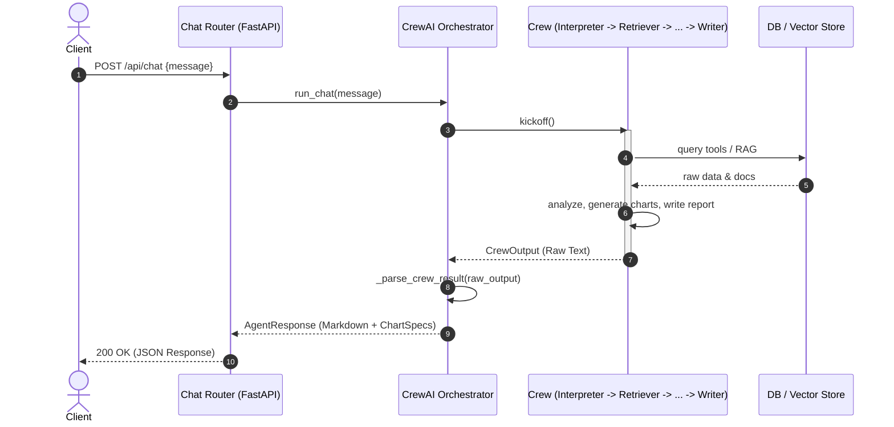
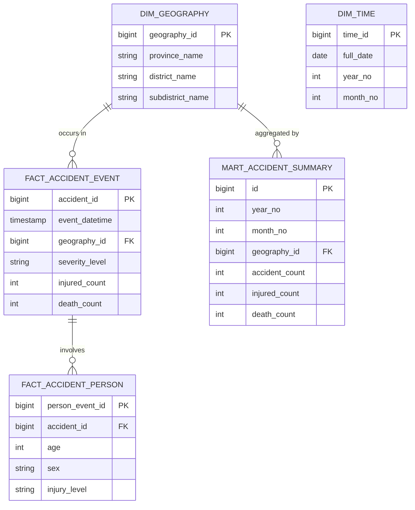

# Agent System Architecture

## 1. Executive Summary & Tech Stack
The **Musya Agent** is an Agentic AI + RAG backend designed to process user queries, retrieve health plan and accident data, analyze it, and generate structured reports with charts. It employs a multi-agent orchestration pattern powered by **CrewAI** and exposes its functionalities via a **FastAPI** REST interface.

**Tech Stack:**
- **Language/Framework:** Python 3.11+, FastAPI, Uvicorn
- **AI/LLM:** CrewAI, Langchain, Google GenAI (Gemini)
- **Databases/Storage:** PostgreSQL (asyncpg, psycopg2), ChromaDB (Vector Store), MinIO (Object Storage)
- **Pattern:** Agent Orchestrator / Microservice / RAG

## 2. Sub-Domain Mapping & Bounded Contexts
The codebase is logically partitioned into several sub-domains:

1. **API / Entrypoints (`src/routers/`)**: Handles HTTP requests, input validation, and streaming (SSE) responses.
2. **Agent Orchestration (`src/agents/`)**: Contains the core logic for the AI crew. Defines specialized agents (Interpreter, Retriever, Analyst, Chart Builder, Report Writer) and the central `orchestrator.py` that wires them together into a sequential pipeline.
3. **RAG & Knowledge Retrieval (`src/rag/`)**: Manages document ingestion, text splitting, and vector similarity search.
4. **Data Access & Tools (`src/db/`, `src/tools/`)**: Provides low-level database connection pooling, MinIO client integrations, and concrete tool implementations that agents can invoke.

## 3. High-Level System Overview Diagram

```mermaid
C4Context
    title Musya Agent - System Overview

    Person(user, "Client Application", "Chat UI (Next.js)")
    
    System_Boundary(agent_system, "Musya Agent Backend") {
        Container(api, "FastAPI Application", "Python", "Exposes REST and SSE endpoints for chat and data ingestion")
        
        Container(orchestrator, "CrewAI Orchestrator", "Python", "Manages the multi-agent workflow (Interpreter -> Retriever -> Analyst -> Chart Builder -> Writer)")
        
        Container(rag, "RAG Engine", "Python", "Handles document vectorization and retrieval")
        
        Container(tools, "Data Tools", "Python", "Executes SQL and fetches structured data")
    }

    SystemDb(postgres, "PostgreSQL", "Relational database for accident facts and dimensions")
    SystemDb(chroma, "ChromaDB", "Vector database for document embeddings")
    SystemDb(minio, "MinIO", "Object storage for raw files")
    SystemExt(gemini, "Google Gemini API", "LLM Provider")

    Rel(user, api, "Sends chat messages", "JSON/REST")
    Rel(api, orchestrator, "Triggers workflow", "Sync/Async")
    Rel(orchestrator, gemini, "Prompts and completions", "API")
    Rel(orchestrator, rag, "Queries knowledge", "Internal")
    Rel(orchestrator, tools, "Executes data queries", "Internal")
    
    Rel(rag, chroma, "Vector search", "gRPC/HTTP")
    Rel(tools, postgres, "SQL Queries", "asyncpg")
    Rel(rag, minio, "Reads/Writes docs", "S3 API")
```

## 4. Project Tree Structure

```text
Agent/
├── database/
│   ├── 001_shared_core.sql
│   ├── 002_document_rag.sql
│   ├── 003_accident_domain.sql
│   ├── 006_province_marts.sql
│   ├── ...
│   └── import_csv.py
├── pyproject.toml
├── src/
│   ├── config.py
│   ├── main.py
│   ├── agents/
│   │   ├── analyst_accident.py
│   │   ├── chart_builder.py
│   │   ├── orchestrator.py
│   │   ├── report_writer.py
│   │   ├── request_interpreter.py
│   │   └── retrieval.py
│   ├── db/
│   │   ├── minio_client.py
│   │   └── pool.py
│   ├── rag/
│   │   ├── database_rag.py
│   │   ├── document_rag.py
│   │   └── vector_store.py
│   ├── routers/
│   │   ├── chat.py
│   │   ├── health.py
│   │   ├── ingest.py
│   │   └── test_ui.py
│   ├── schemas/
│   │   ├── request.py
│   │   └── response.py
│   └── tools/
│       ├── accident.py
│       ├── chart_builder.py
│       └── common.py
└── tests/
```

## 5. API Traces & Sequence Diagrams

### `POST /api/chat`
**Purpose:** Main entry point for user chat interactions. Runs the full agent pipeline.
**Sub-calls Trace:**
1. `chat(request)`: Validates input and invokes `run_chat()`.
2. `run_chat(user_message)`: Builds the Crew AI pipeline in `orchestrator.py`.
3. The orchestration pipeline executes the following tasks sequentially:
   - **Interpreter Task**: Parses user intent (topic, geography, time range).
   - **Retrieval Task**: Queries RAG and DB via tools.
   - **Analyst Task**: Processes retrieved data to find trends and risks.
   - **Chart Build Task**: Generates `ChartSpec` JSON objects.
   - **Write Task**: Compiles the final Markdown report.
4. `_parse_crew_result()`: Extracts charts, follow-up questions, and formats the output into an `AgentResponse` schema.



## 6. Data Models (ER Diagrams)

The data architecture separates dimensional data (Geography, Time) from fact tables (Accident Events, Persons) and aggregates them into analytic marts for fast retrieval by the agents.



## 7. Architectural Assessment & Recommendations

- **Separation of Concerns:** The project structure is clean. API routing is well-separated from the business logic (`orchestrator`), data access (`db`/`rag`), and domain schemas (`schemas`).
- **Data Pipeline Efficiency:** Using pre-aggregated marts (`mart_accident_summary`, `mart_accident_hotspot`) is an excellent choice for an LLM-driven application, reducing latency and token usage when the retriever agent queries data.
- **Synchronous CrewAI Pipeline:** The `chat_stream` endpoint uses Server-Sent Events but currently wraps a synchronous CrewAI `kickoff()`. The SSE implementation yields a "start" event and then blocks until the entire crew finishes before yielding the full result.
  - *Recommendation:* Consider leveraging asynchronous tasks or callbacks within CrewAI (if supported) to stream intermediate thoughts or partial responses (like the interpreter's JSON output) back to the client for better perceived latency.
- **Error Handling & Observability:** Strong use of step and task callbacks (`_step_callback`, `_task_callback`) for logging agent thoughts and actions. This is crucial for debugging non-deterministic LLM behavior.
